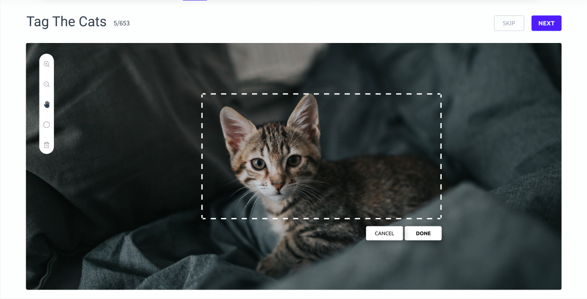

We are engineers. We are not just any kind of engineers, but the machine-learning kind — which is the worst kind. We are the people who automate those tasks that have for a long time been reserved for humans, such as reading street signs, recognising objects in home movies, interpreting weather patterns, sorting family albums, securely authenticating people using just their phone camera.

But we are the engineers who realized two things:

It is up to every citizen to make sure that the way they uses technology is a force for the good in society. This is especially the responsibility of those building technology.

1.  No matter how sudden the progress of machine learning or technology, **humans must be kept in the loop,** both, to improve performance and to safeguard the use of technology to the standards of the community.

As engineers, we’ve been following the conversation around artificial intelligence and automation taking over jobs and leading to mass unemployment. We’ve also heard the arguments for dealing with the wave of unemployment by introducing forms of Universal Basic Income. While individually those policies might fail, we believe we have a pattern for weaving them into a working system.

As engineers, we often experience how reality is rarely at the extremes and rarely as simple as we initially imagine. We can’t be as optimistic as to expect robots to do all our jobs for us well, without intended consequences, without our intervention, without our mediation, without our input and without our (physical or mental) presence.

At Knosis we believe in AI. And we believe AI stands for Augmented Intelligence. A better suited term would be Artificial Collaborative Intelligence (A.C.I.). We work to build a future where machines and humans collaborate in providing trusted service to the community. We strive for creating a world where the two forces of intelligence, carbon and silicon based, are joined in fighting the harshness and absurdity of the universe, not fighting each other.

We envisage Knosis as a marketplace for curated human input given on relevant machine learning data sets and data streams.

Jiratech test
